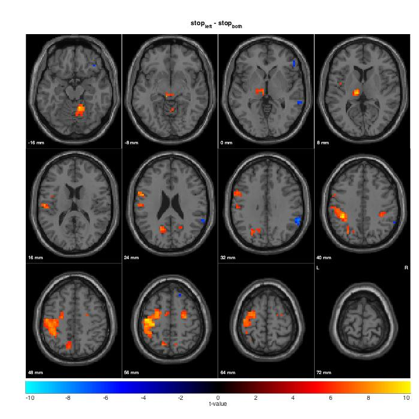
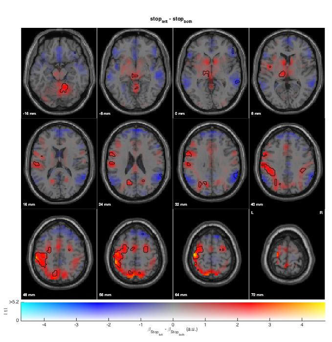

# Slice Display

## Overview

Slice Display is a MATLAB toolbox for visualizing fMRI data. Besides standard fMRI displays, it can make dual-coded images (simultaneous display of contrast estimate and unthreshold t-statistic maps). Data visualizations can be entirely scripted, so that generating figures is easy and reproducible.

_Typical visualization of fMRI data - thresholded t-map_


_Alternative visualization of fMRI data - dual-coded map_

- Simultaneous display of effect size (color-coded) and unthresholded inferential statistics (opacity-coded)
- Contours distinguish statistically significant and non-significant voxels
- Show more and hide less, while allowing for spatial localization



## Getting started

### Requirements

* [MATLAB](http://www.mathworks.com)
* [MATLAB Statistics Toolbox](http://www.mathworks.com/products/statistics/)
* [SPM](http://www.fil.ion.ucl.ac.uk/spm/) by the Wellcome Trust Centre for Neuroimaging at UCL
* [Panel](https://www.mathworks.com/matlabcentral/fileexchange/20003-panel) by Ben Mitch

### Intstallation

You can either download the code as a ZIP file or you can clone the code:

To download the code:
1. Go to the [Slice Display repository on GitHub](https://github.com/bramzandbelt/slice_display).
2. Select 'Download ZIP' from the green 'Clone or download' button.

To clone the code, run the following command on the command line (require Git to be installed):

```
git clone https://github.com/bramzandbelt/slice_display.git
```

### Usage

See the example scripts in the directory 'examples'.

### Papers & preprints using Slice Display

- [van Lieshout, L. L., Vandenbroucke, A. R., Müller, N. C., Cools, R., & de Lange, F. P. (2018). Induction and relief of curiosity elicit parietal and frontal activity. Journal of Neuroscience, 38(10), 2579-2588.](https://doi.org/10.1523/JNEUROSCI.2816-17.2018)
- [Richter, D., Ekman, M., & de Lange, F. P. (2018). Suppressed sensory response to predictable object stimuli throughout the ventral visual stream. Journal of Neuroscience, 38(34), 7452-7461.](https://doi.org/10.1523/JNEUROSCI.3421-17.2018)
- [Ai, H., Xin, Y., Luo, Y., Gu, R., & Xu, P. (2019). Volume of motor area predicts motor impulsivity. European Journal of Neuroscience.](https://doi.org/10.1111/ejn.14339)

### Citation
If you intend to publish figures obtained with this code, cite it as follows:

- Zandbelt, Bram (2017): Slice Display. figshare. 10.6084/m9.figshare.4742866.

If you intend to publish figures using dual-coded design, also cite the following paper:

- Allen, E. A., Erhardt, E. B., & Calhoun, V. D. (2012). Data Visualization in the Neurosciences: Overcoming the Curse of Dimensionality. Neuron, 74(4), 603–608. https://doi.org/10.1016/j.neuron.2012.05.001

## Colophon

### Version

Version 0.1 - March 2017

### Contact

E-mail: bramzandbelt@gmail.com  

### Acknowledgment

Slice Display was inspired by and builds on the slice overlay toolbox by Matthew Brett, available through SPM.

### References

Allen, E. A., Erhardt, E. B., & Calhoun, V. D. (2012). Data Visualization in the Neurosciences: Overcoming the Curse of Dimensionality. Neuron, 74(4), 603–608. https://doi.org/10.1016/j.neuron.2012.05.001
